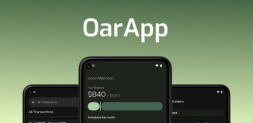
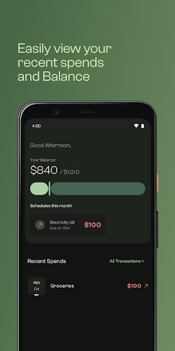
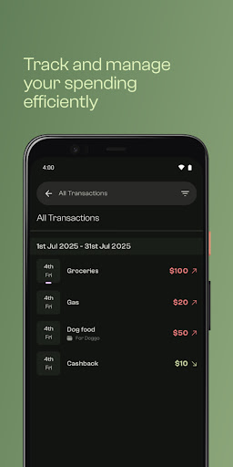
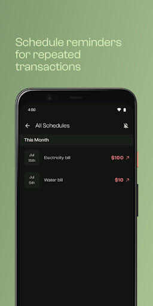
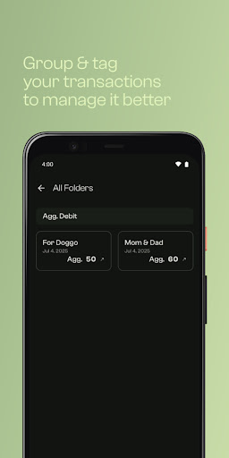
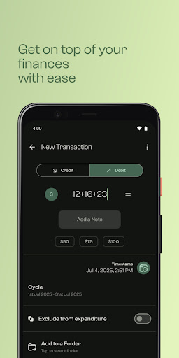

<br/>
<p align="center">
  
</p>
<h3 align="center">Oar</h3>
<p align="center">
  An Android app to help track and manage your expenses
</p>

<p align="center">
  
  
  
  <a href="https://github.com/remi-naz/Oar/releases/latest"></a>
  <a href="https://github.com/remi-naz/Oar/issues"></a>
</p>

<p align="center">
  <a href="https://play.google.com/store/apps/details?id=dev.ridill.oar">Get it on Google Play</a>
  ·
  <a href="https://github.com/remi-naz/Oar/issues">Report Bug</a>
  ·
  <a href="https://github.com/remi-naz/Oar/issues">Request Feature</a>
  ·
  <a href="https://remi-naz.github.io/Oar/privacy-policy.html">Privacy Policy</a>
</p>

<br/>

## Table of Contents

- [About](#about)
- [Screenshots](#screenshots)
- [Features](#features)
- [Built With](#built-with)
- [Getting Started](#getting-started)
- [Contributing](#contributing)
- [Authors](#authors)

## About

<p align="center">
  
</p>

Oar is a user-friendly Android application designed to empower individuals in managing their
finances effectively. With Oar, users can effortlessly track and control their expenses, helping
them maintain financial discipline and achieve their financial goals. This mobile app provides a
comprehensive expense tracking and budget management solution, allowing users to take control of
their financial well-being.

## Screenshots

<p align="center">
  
  
  
  
  
</p>

## Features

- **Transactions** — Log income and expenses, and browse them in a paged, filterable list.
- **Folders** — Group related transactions together (e.g. a trip or a project) and track their
  combined total.
- **Tags** — Tag transactions to categorize spending and filter your history by tag.
- **Budget Cycles** — Set a monthly budget and track your balance against it across cycles.
- **Schedules** — Set up recurring transactions with reminder notifications so nothing gets missed.
- **Aggregations** — See spending broken down and summarized over time.
- **Encrypted Google Drive Backup** — Optionally sign in and back up/restore your data to your own
  Google Drive account, encrypted before upload.
- **Biometric App Lock** — Lock the app behind device biometrics for extra privacy.
- **Local-first storage** — All data lives on-device by default; nothing is sent anywhere unless you
  turn on backup.

## Built With

- **Kotlin** & **Jetpack Compose** for the UI, with **Navigation 3** for app navigation
- **Room** (SQLite) for local persistence, with **Paging 3** for the transaction lists
- **Hilt** for dependency injection
- **WorkManager** for scheduled/background work (reminders, backups)
- **DataStore Preferences** for app settings
- **AndroidX Biometric & Security Crypto** for app lock and encrypted backups
- **Firebase** (Auth, Crashlytics, Analytics, Remote Config) and **Google Drive API** for optional
  sign-in and cloud backup

## Getting Started

1. Clone the repo
   ```sh
   git clone https://github.com/remi-naz/Oar.git
   ```
2. Open the project in Android Studio (or build from the CLI):
   ```sh
   ./gradlew assembleInternalDebug
   ```
3. Install on a connected device/emulator:
   ```sh
   ./gradlew installInternalDebug
   ```

> Google sign-in and Drive backup require your own `google-services.json` under `app/`, since
> Firebase/Google credentials aren't checked into the repo.

---

## Contributing

### Creating A Pull Request

1. Fork the Project
2. Create your Feature Branch (`git checkout -b feature/AmazingFeature`)
3. Commit your Changes (`git commit -m 'Add some AmazingFeature'`)
4. Push to the Branch (`git push origin feature/AmazingFeature`)
5. Open a Pull Request

## Authors

* **Ridill** - *Android Developer* - [Ridill](https://github.com/RemijiusBrian) - **
